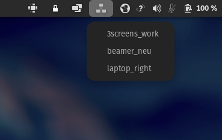
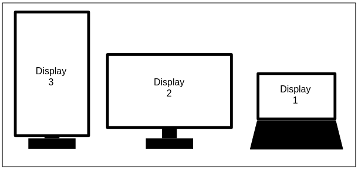
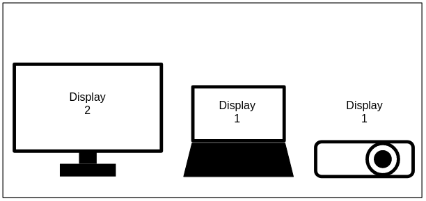
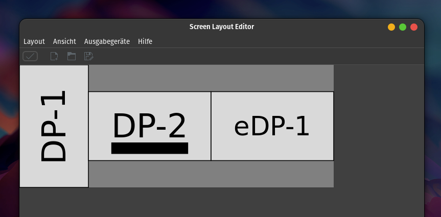
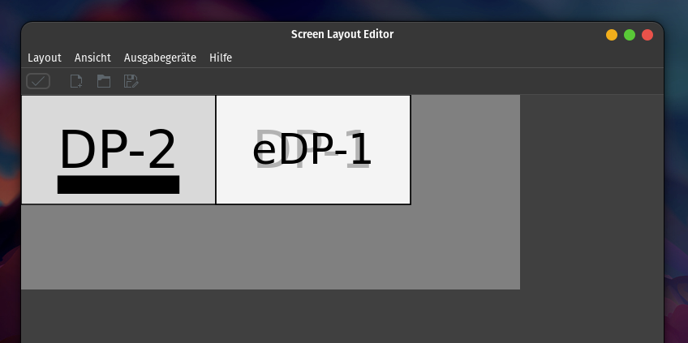
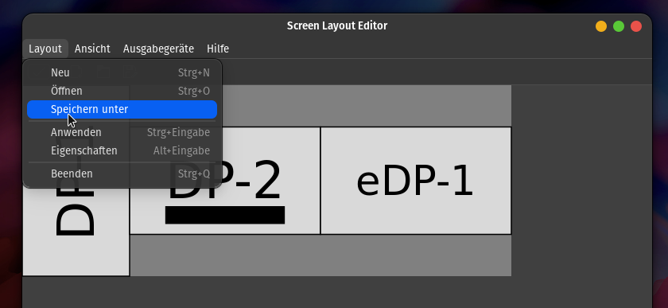
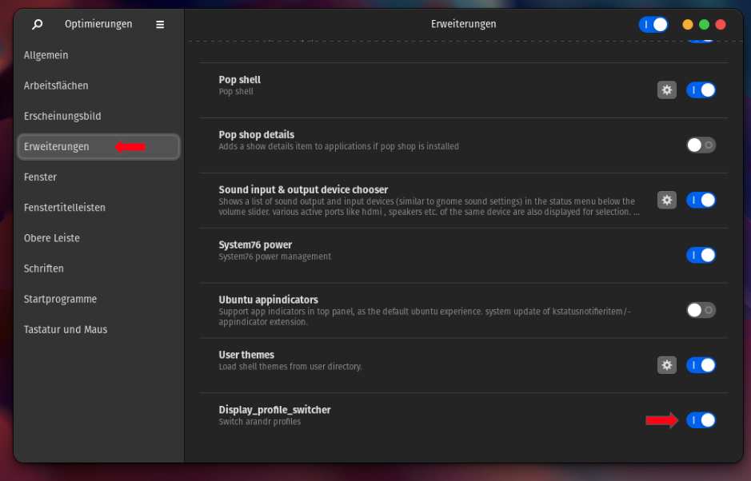

# Display Profile Switcher - GNOME Extension

Activate differen [xrandr](https://de.wikipedia.org/wiki/RandR)/[arandr](https://christian.amsuess.com/tools/arandr/) display profiles from the top panel in GNOME.



## Motivation

### TLDR:
- I have 4 displays (1 Laptop, 2 Monitors, 1 Beamer)
- My laptop can only handle 3 displays
- I have 2 differents set-ups with 3 displays each
- I use hdmi-switches to avoid unplugging cables
- I didn't find a way to automatically detect which display is connected (after using the cheap hdmi switch)
- So I wrote a small GNOME extension to manually activate different [xrandr](https://de.wikipedia.org/wiki/RandR)
 profiles which i created with [arandr](https://christian.amsuess.com/tools/arandr/)


### Long version:

I have two different 3 screen set-ups (max my graphics card can handle)  that I use with my laptop (XPS 13 7390). Laptop and one screen are always connected but the third screen is either a vertical monitor or a beamer, depending on if I work or if I play games or watch movies.

Layout a)| Layout b)
------------ | -------------
3 screens for work | 2 Screens, one mirrored to beamer for playing games
| 

I created 2 different profiles with [arandr](https://christian.amsuess.com/tools/arandr/) that have the right display configurations. It's possible so save these layouts as `.sh` files with the [xrandr](https://de.wikipedia.org/wiki/RandR)-command in it, e.g.:

```bash
xrandr --output eDP-1 --mode 1920x1080 --pos 1920x0 --rotate normal --output DP-1 --mode 1920x1080 --pos 1920x0 --rotate normal --output DP-2 --primary --mode 1920x1080 --pos 0x0 --rotate normal
```
These profiles can also be opened and edited again with [arandr](https://christian.amsuess.com/tools/arandr/).

Layout a)| Layout b)
------------ | -------------
3 screens for work | 2 Screens, one mirrored to beamer for playing games
| 

At first I was still changing the HDMI cable between my vertical monitor and my beamer. It was possible to find out which display is connected and and activate the right profile automatically (loosely based on [this](https://askubuntu.com/questions/630202/run-script-when-monitor-is-connected)). **But I had to unplug/plug-in the HDMI cable at my laptop everytime, for the system to get the new devicename.**
That annoyed me much, so I bought a HDMI-switch and some short HDMI cables. The problem here is, that I **still have to re-connect the HDMI cable to the laptop every time,** because the system doesnt register that the device has changed. That basically destroys all the convenience I was trying to achieve and **I didn't find any way to automate this.**
To reduce the physical wear on my USB-C and HDMI ports, I started opening [arandr](https://christian.amsuess.com/tools/arandr/) manually and activating the right profile, ALL THE TIME.
**So I wrote a GNOME extension to make this easier for me**

## Features
- automatically add all `<filename>.sh` [arandr](https://christian.amsuess.com/tools/arandr/)-profiles to the drop down
    - profiles are always loaded from `/home/<username>/.screenlayout/`, where [arandr](https://christian.amsuess.com/tools/arandr/) saves its profiles
- activate profile when clicking on it

#### Still missing (or rather features I am considering)

- auto update the list without restarting gnome
- mark currently active profile (with a logo in front of it or something)
- keybindings to quick-switch profiles
- settings to specify path to the profiles
- having an icon for each profile (displayed in the dropdown menu)
- re-implementing the "automatically switch" feature somehow (with a possibility to activate/deactivate)

## Install

- clone the repository somewhere:

```bash
git clone https://github.com/zagatta/display_profile_switcher
```

- go into then folder
- make install script executable
- run install script
    - only copies the files to `/home/<username>/.local/share/gnome-shell/extensions/`

```bash
cd display_profile_switcher
chmod +x ./install.sh
./install.sh
```
- install and launch [arandr](https://christian.amsuess.com/tools/arandr/)
```bash
sudo apt install arandr && arandr
```

- create your display configuration, e.g.

- save it to `/home/<username>/.screenlayout/`



- restart GNOME

```bash
killall -SIGQUIT gnome-shell
```

- Install and launch [GNOME Tweak Tool](https://itsfoss.com/gnome-tweak-tool/)

```bash
sudo apt install gnome-tweaks && gnome-tweaks
```
- launch gnome tweaks
- activate **Display Profile Switcher** extension



## DONE

You should have an icon in the top panel with a dropdown menu of all your profiles now: **Just click on one to activate.**
